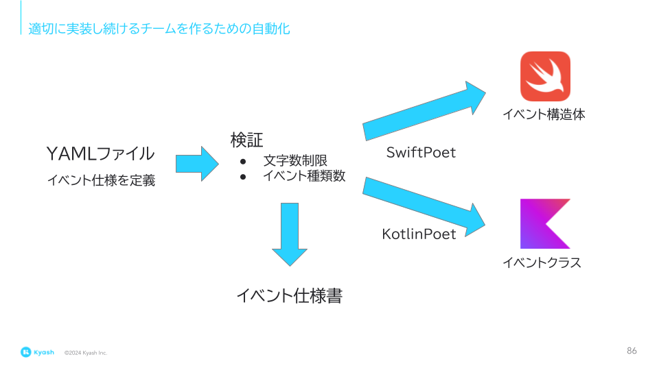
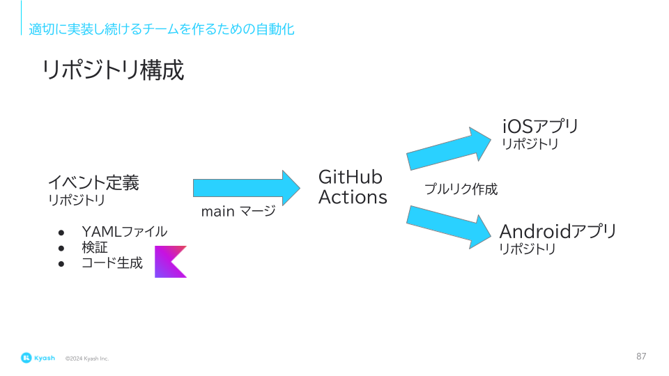

# DroidKaigi 2024「 データに基づく意思決定を支える、Google Analytics for Firebase のイベント送信」の YAML ファイルによる Analytics イベント定義リポジトリ実装例

同一仕様の [iOS アプリ](https://github.com/tfandkusu/ga913-ios)と [Android アプリ](https://github.com/tfandkusu/ga913-android)に対して、YAML ファイルで定義した Analytics イベントに対応する構造体 / クラスを自動コード生成するリポジトリです。

## イベント仕様書

- [画面遷移イベント](https://github.com/tfandkusu/ga913-yaml/blob/main/screens.md)
- [画面内操作イベント](https://github.com/tfandkusu/ga913-yaml/blob/main/actions.md)

## 概要

アプリ開発者は YAML ファイルに [Google Analytics for Firebase](https://firebase.google.com/docs/analytics) のイベントの仕様を定義します。

本システムは YAML ファイルに対して、[文字数、種類数](https://support.google.com/analytics/answer/9267744)、イベント名重複のチェックを行います。そして iOS / Android アプリに対して、イベント構造体 / クラスを自動作成します。





### 解決できる課題

1. 文字数制限やイベント名の種類数制限を超えたイベントを送信してしまう
2. iOS と Android でイベント名やイベントパラメータ名が違う
3. イベント仕様の共有

### 自動生成されたイベント構造体　/ クラスの例

- [iOS アプリ向けイベント構造体](https://github.com/tfandkusu/ga913-ios/blob/main/Landmarks/Analytics/AnalyticsEvent.swift)
- [Android アプリ向けイベントクラス](https://github.com/tfandkusu/ga913-android/blob/main/viewCommon/src/main/java/com/tfandkusu/ga913android/analytics/AnalyticsEvent.kt)

###  自動生成されたイベント構造体　/ クラスの使用箇所

- [iOS アプリ向け AnalyticsEventSender 構造体](https://github.com/tfandkusu/ga913-ios/blob/main/Landmarks/Analytics/AnalyticsEventSender.swift)
- [Android アプリ向け AnalyticsEventSender クラス](https://github.com/tfandkusu/ga913-android/blob/main/viewCommon/src/main/java/com/tfandkusu/ga913android/analytics/AnalyticsEventSender.kt)

Analytics イベント送信担当メソッドは、自動生成された構造体 / クラスを引数に取ることにより、未定義のイベントを送信することを防いでいる。

## 使用方法

### YAML ファイルを編集する

[events.yaml](https://github.com/tfandkusu/ga913-yaml/blob/main/events.yaml) ファイルに Analytics イベント仕様を定義します。

```yaml
- description: ランドマーク一覧画面
  class: LandmarkList
  value: LandmarkList
  conversion: false
  actions:
    - description: いいねを付けたランドマークのみを表示するスイッチ
      class: FavoritesOnlySwitch
      value: FavoritesOnlySwitch
      parameters:
        - description: スイッチの ON/OFF
          property: favoritesOnly
          key: favorites_only
          type: boolean
```


各フィールドの解説

|フィールド名| 解説 |
| --- | --- |
| description | 画面の説明文 |
| class | 画面遷移イベント構造体 / クラスの名前 |
| value | Analytics 画面遷移イベント名 |
| conversion | 独自のイベント名にするか、screen_view イベントの screen_name パラメータの value にするかのフラグ |
| actions[].description | 画面内操作の説明文 |
| actions[].class | 画面内操作クラス名 |
| actions[].value | 画面内操作イベント名 |
| actions[].parameters[].description | パラメータの説明文 |
| actions[].parameters[].property | Swift / Kotlin でのプロパティ名 |
| actions[].parameters[].key | Analytics イベントパラメータの key |
| actions[].parameters[].type | Analytics イベントパラメータ value の型。string, int, long, float, double, boolean が設定可能 |
| actions[].parameters[].conversion | 独自のイベント名にするか、イベントパラメータの value で区別するかのフラグ |

### プルリクを作成する

プルリクを作成すると GitHub Actions により、以下の処理が実行されます。

- [イベント仕様の検証](https://github.com/tfandkusu/ga913-yaml/blob/main/.github/workflows/check.yml)
- [イベント仕様書を作成するコミットを追加](https://github.com/tfandkusu/ga913-yaml/blob/main/.github/workflows/make_document.yml) (ドラフトで無いときのみ実行)

### main ブランチにマージする

main ブランチにマージすると、GitHub Actions により、以下の処理が実行されます。

- [iOS / Android アプリリポジトリにプルリクエストを作成する](https://github.com/tfandkusu/ga913-yaml/blob/main/.github/workflows/make_pr.yml)

サンプルアプリに向かって、プルリクエストを作成します。
自分のアプリに対してプルリクエストを作成する場合は、本リポジトリをフォークの上、[ワークフロー](https://github.com/tfandkusu/ga913-yaml/blob/main/.github/workflows/make_pr.yml)を修正してください。

Analytics イベント構造体 / クラスのパッケージ名、ディレクトリ名を変更する場合は、こちらを改修します。

- [SwiftGenerator.kt](https://github.com/tfandkusu/ga913-yaml/blob/main/src/main/kotlin/com/tfandkusu/ga913yaml/SwiftGenerator.kt)
- [KotlinGenerator.kt](https://github.com/tfandkusu/ga913-yaml/blob/main/src/main/kotlin/com/tfandkusu/ga913yaml/KotlinGenerator.kt)

